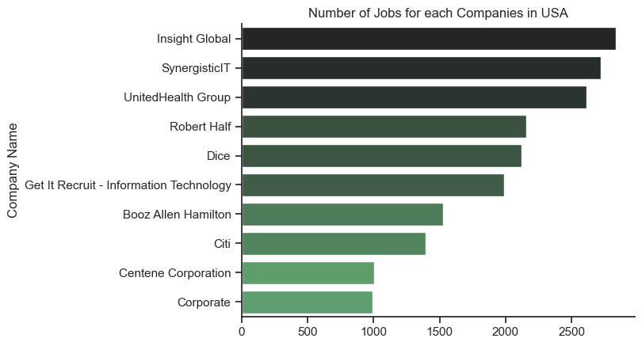

## Data Analyst Job Prospects: USA vs. Canada

In this project, I analyze the job market for data analysts in the USA and Canada, comparing essential factors that influence job prospects in both countries. The focus is on identifying which country offers higher revenue for specific skills, determining the key skills required to secure a job, and evaluating the advantages of working remotely versus onsite. Using visualizations created with `Matplotlib` and `Seaborn`, I provide insights into the top skills in demand, the highest-paying skills, and the distribution of job opportunities across different companies and locations.

The dataset, sourced from [LukeBarousse](https://www.lukebarousse.com/sql), includes information on job postings, required skills, and salaries, enabling a comprehensive analysis of the job market for data professionals. By exploring these factors, this project aims to guide job seekers in making informed decisions about their career paths, skill development, and work preferences.

### Insights Based on the Upcoming Charts:

1. **Skills in Demand Across Job Titles**:
   - **Data Analyst**: Both in Canada and the USA, SQL, Excel, and Python are consistently the most in-demand skills for data analysts. However, Tableau is more emphasized in the USA, while Power BI and Spark are highlighted in Canada.
   - **Data Engineer**: SQL and Python remain crucial, but cloud-based skills like AWS and Azure are also essential, reflecting the increasing demand for cloud computing expertise in this role.
   - **Senior Data Engineer/Data Scientist**: Python and SQL are foundational, but the addition of R, Spark, and SAS for Data Scientists suggests a broader range of statistical and analytical tools are needed as you advance in your career.

2. **Highest-Paying Skills**:
   - In both countries, cloud platforms (AWS, GCP) and advanced analytical tools (Hadoop, Spark, Looker, Snowflake) are associated with higher salaries, especially in more advanced roles like Data Engineer or Senior Data Analyst. Learning these skills could significantly boost earning potential.
   - The USA shows a higher median salary for specialized skills like DPLYR and VMware, which might indicate a more mature market with higher pay for niche skills.

3. **Job Opportunities by Location and Company**:
   - In Canada, large employers like ATB Financial and Insight Global dominate job postings, with significant opportunities also in tech hubs like Toronto, Calgary, and Vancouver. However, remote work options are also abundant.
   - The USA offers a broader range of job opportunities, with companies like Insight Global, SynergisticIT, and UnitedHealth Group leading the way. The focus is more on urban areas, but like in Canada, remote work remains a strong option.

4. **Career Path and Skill Development Recommendations**:
   - For those entering the field, starting with Data Analyst roles and focusing on SQL, Excel, and Python is a safe bet in both countries. As you advance, learning cloud-based platforms and specialized analytical tools can open up higher-paying opportunities in Data Engineering or Data Science.
   - Given the high demand for remote work options in both countries, developing a strong skill set that includes project management and remote collaboration tools (e.g., Git, Slack) could further enhance job prospects.

This project ultimately provides a detailed comparison to help data professionals strategically plan their careers, optimize their skill sets, and choose the best working conditions to meet their personal and professional goals.

### I) Chart 1: Number of Jobs for each Company in Canada
```
df_plot_local = df_canada['job_location'].value_counts().head(10).to_frame()
# sbn.set_theme(style='ticks')
sbn.barplot(data=df_plot_local, x='count', y='job_location', hue='count' ,palette='dark:g_r', legend=False)
plt.ylabel('Job Location')
plt.xlabel('')
plt.title('Number of Jobs in Canada for each Location')
sbn.despine()
```


#### Analysis:
- **ATB Financial** has the highest number of job postings, significantly more than the others, with over 100 job postings.
- **Insight Global**, **University of Alberta**, and **Air Canada** also have a high number of job postings, ranging from 80 to 90.
- Other companies like **Metrolinx**, **BRP**, **Talentify.io**, **Procom**, **Electronic Arts**, and **Kijiji** have fewer job postings, ranging from approximately 40 to 70.

#### Insights:
- ATB Financial is the leading company in terms of job availability in Canada.
- The variety of companies suggests opportunities across different industries, from finance (ATB Financial) to technology (Talentify.io) and education (University of Alberta).

### II) Chart 2: Number of Jobs for each Company in USA

```

```



#### Analysis:
- **Insight Global** leads with over 2500 job postings, followed by **SynergisticIT** and **UnitedHealth Group** with more than 2000 and 1500 postings respectively.
- Companies like **Robert Half**, **Dice**, **Get It Recruit - Information Technology**, and **Booz Allen Hamilton** have a considerable number of job postings, ranging from 1000 to 1500.
- **Citi**, **Centene Corporation**, and **Corporate** have fewer job postings but still significant, ranging from 500 to 1000.

#### Insights:
- Insight Global has a dominant presence in the job market in the USA.
- There are numerous opportunities in various sectors including IT (SynergisticIT, Dice), healthcare (UnitedHealth Group, Centene Corporation), and finance (Citi).

### III) Chart 3: Number of Jobs in Canada for each Location


#### Analysis:
- The label **Canada** indicates a general or unspecified location, leading with over 4000 job postings.
- **Anywhere** follows with a significant number of postings, indicating flexibility in job location.
- Specific cities like **Calgary, AB**, **Toronto, ON**, **Edmonton, AB**, and **Mississauga, ON** have a notable number of job postings, ranging from approximately 300 to 700.
- Other cities like **Winnipeg, MB**, **Montreal, QC**, **Vancouver, BC**, and **Ontario** have fewer postings but still represent key job markets.

#### Insights:
- There is a high demand for jobs that can be done from any location, showing a trend towards remote work.
- Major cities like Calgary, Toronto, and Edmonton are important job hubs in Canada.
- The spread of job postings across multiple cities indicates diverse opportunities in various regions.

### General Observations:
- The charts provide a clear visualization of job distribution across different companies and locations in Canada and the USA.
- The presence of multiple companies and cities with a high number of job postings suggests a robust job market with opportunities in various sectors and regions.
- The trend towards remote work is evident in the Canadian job market, as indicated by the high number of postings for "Anywhere".


## IV) Chart 4:Ploting 4 in 1

### Overview:
This image provides a detailed comparison between the top skills in demand and the highest-paid skills for Data Analysts in Canada and the USA. It highlights the differences and similarities in the job market between the two countries, helping professionals and job seekers understand where they might want to focus their learning and development efforts.


```
fig, ax = plt.subplots(2, 2, figsize=(15, 10))

# Plot for Canada
df_can_goup_high_p[::-1].plot(kind='barh', y='median', ax=ax[0, 0], color='skyblue')
df_can_goup_high_count[::-1].plot(kind='barh', y='count', ax=ax[0, 1], color='lightgreen')

# Set title and labels for the top highest paid skills plot in Canada
ax[0, 0].set_title('Top Highest Paid Skills for Data Analyst in CANADA')
ax[0, 0].set_xlabel('Median Salary Per Year')
ax[0, 0].set_ylabel('')
# Format the x-axis to display salary in thousands
ax[0, 0].xaxis.set_major_formatter(plt.FuncFormatter(lambda x, pos: f'${int(x/1000)}K'))

# Set title and labels for the top skills in-demand plot in Canada
ax[0, 1].set_title('Top Skills In-Demand for Data Analyst in CANADA')
ax[0, 1].set_xlabel('Top Skills In-Demand')
ax[0, 1].set_ylabel('')


# Plot for USA
# Plot the median salaries for top highest paid skills in the USA
df_us_goup_high_p[::-1].plot(kind='barh', y='median', ax=ax[1, 0], color='orange')

# Set title and labels for the top highest paid skills plot in the USA
ax[1, 0].set_title('Top Highest Paid Skills for Data Analyst in USA')
ax[1, 0].set_ylabel('')
ax[1, 0].set_xlabel('Median Salary Per Year')

# Format the x-axis to display salary in thousands
ax[1, 0].xaxis.set_major_formatter(plt.FuncFormatter(lambda x, pos: f'${int(x/1000)}K'))

# Plot the counts for top skills in-demand in the USA
df_us_goup_high_count[::-1].plot(kind='barh', y='count', ax=ax[1, 1], color='salmon')

# Set title and labels for the top skills in-demand plot in the USA
ax[1, 1].set_title('Top Skills In-Demand for Data Analyst in USA')
ax[1, 1].set_xlabel('Top Skills in-Demand')
ax[1, 1].set_ylabel('')

# Adjust layout to prevent overlap
fig.tight_layout()
# Display the plots
plt.show()
```

### Top Highest Paid Skills for Data Analysts in Canada:
- **Looker** is the highest-paid skill, with a median salary of over $120K per year.
- Other top-paying skills include **Snowflake**, **Redshift**, **Hadoop**, **Spark**, and **BigQuery**, all of which are related to data processing, storage, and cloud computing.
- The range of salaries for these top skills varies between approximately $80K to $120K per year.

### Top Skills In-Demand for Data Analysts in Canada:
- **SQL** and **Python** are the most in-demand skills, with SQL leading by a significant margin.
- **Tableau**, **Excel**, and **SAS** are also highly sought after, indicating a strong need for data visualization and statistical analysis skills.
- Other notable skills in demand include **Power BI**, **VBA**, and **Google Sheets**.

### Top Highest Paid Skills for Data Analysts in the USA:
- **Dplyr** (a data manipulation package in R) is the highest-paid skill, with a median salary approaching $200K per year.
- Other top-paying skills include **Bitbucket**, **GitLab**, **Solidity**, and **Hugging Face**, many of which are related to software development, version control, and AI.
- The salary range for these top skills is between $150K and $200K per year, which is notably higher than the top-paying skills in Canada.

### Top Skills In-Demand for Data Analysts in the USA:
- **SQL** is overwhelmingly the most in-demand skill, with a count far exceeding other skills.
- **Excel** and **Python** are also highly in-demand, followed by **Tableau**, **SAS**, and **R**.
- The demand for **Power BI** and **PowerPoint** suggests a need for skills in both data visualization and presentation.

### Insights:
- **Salary Discrepancy**: The highest-paid skills in the USA tend to command significantly higher salaries compared to those in Canada, particularly for skills related to software development and AI.
- **Common Skills in Demand**: Both countries show a high demand for SQL, Python, and Tableau, indicating that these are essential skills for Data Analysts regardless of location.
- **Specialized Skills**: The USA has a higher demand and compensation for specialized skills like Dplyr and Hugging Face, which are associated with more advanced data manipulation and AI, whereas Canada's market shows strong demand for cloud-related skills like Looker, Snowflake, and BigQuery.

### Conclusion:
This comparison provides valuable insights into the current data analytics job market in Canada and the USA. Professionals aiming to maximize their earning potential should consider developing expertise in the highest-paying skills, especially those that are in high demand in their region. Understanding these trends can guide career development and help job seekers tailor their skill sets to meet market demands.

## 5: Still working Skills but now using the Percentages 
### Analysis of Skills In-Demand for Data Roles in Canada and the USA
#### Canada's Top Three Job Titles and Most Sought-After Skills (Percentage Breakdown)


#### USA's Top Three Job Titles and Most Sought-After Skills (Percentage Breakdown)

#### **Canada:**
- **Data Analyst:**
  - **Top Skill:** SQL (15%)
  - **Other Key Skills:** Excel (9%), Python (9%), Tableau (7%), Power BI (6%)
  - **Perspective:** SQL is the most critical skill for Data Analysts in Canada, followed by Excel and Python, which are equally important. For someone looking to start a career as a Data Analyst, a strong focus on SQL, combined with proficiency in Excel and Python, would be essential.

- **Data Engineer:**
  - **Top Skills:** SQL and Python (9% each)
  - **Other Key Skills:** Azure (5%), AWS (5%), Spark (5%)
  - **Perspective:** SQL and Python are equally critical for Data Engineers in Canada. Given the emphasis on cloud platforms like Azure and AWS, it’s clear that cloud computing skills are also highly valued. Aspiring Data Engineers should prioritize SQL, Python, and cloud platforms to increase their employability.

- **Senior Data Engineer:**
  - **Top Skills:** Python and SQL (9% each)
  - **Other Key Skills:** AWS (6%), Spark (5%), Azure (5%)
  - **Perspective:** Senior roles also demand strong proficiency in Python and SQL. AWS is slightly more valued than Azure in senior roles, suggesting that experience with AWS could be advantageous. Building on SQL, Python, and AWS would be strategic for advancing to senior positions.

#### **USA:**
- **Data Analyst:**
  - **Top Skill:** SQL (14%)
  - **Other Key Skills:** Excel (11%), Tableau (8%), Python (8%), SAS (5%)
  - **Perspective:** Similar to Canada, SQL is the dominant skill for Data Analysts in the USA. Excel remains significant, and there’s a noticeable emphasis on Tableau, a popular data visualization tool. A career as a Data Analyst in the USA would benefit from a strong foundation in SQL, Excel, and Tableau, with Python as an additional valuable skill.

- **Data Engineer:**
  - **Top Skills:** SQL (10%), Python (9%)
  - **Other Key Skills:** AWS (6%), Spark (5%), Azure (5%)
  - **Perspective:** The skills in demand mirror those in Canada, with SQL and Python being paramount. AWS is again a vital skill, though slightly more emphasized than Azure. Those looking to secure Data Engineer roles in the USA should focus on SQL, Python, and AWS.

- **Data Scientist:**
  - **Top Skill:** Python (13%)
  - **Other Key Skills:** SQL (10%), R (8%), SAS (5%), Tableau (4%)
  - **Perspective:** Python emerges as the most critical skill for Data Scientists in the USA, which is expected given the language’s importance in machine learning and data analysis. SQL follows closely, emphasizing its necessity even in more advanced data roles. Prospective Data Scientists should hone their Python and SQL skills and consider learning R for statistical analysis.

### **General Recommendations:**
- **SQL and Python:** Across all roles and regions, SQL and Python consistently rank as top skills, making them essential learning areas for anyone interested in data roles.
- **Excel and Tableau:** For Data Analysts, proficiency in Excel and Tableau can significantly boost job prospects, particularly in the USA.
- **Cloud Platforms:** Knowledge of cloud platforms like AWS and Azure is crucial for Data Engineers, with AWS being slightly more in demand.
- **Specialization:** While foundational skills like SQL and Python are necessary, specialization in tools like Tableau, SAS, or cloud platforms can distinguish candidates, especially when aiming for roles in data engineering or data science.

### **Strategic Path:**
- **Entry-Level Data Analyst:** Focus on mastering SQL, Excel, and Tableau to build a strong foundation.
- **Transition to Data Engineering:** Build on SQL and Python proficiency while gaining expertise in cloud platforms like AWS or Azure.
- **Advanced Roles (Data Scientist or Senior Data Engineer):** Deepen Python skills, add statistical tools like R, and gain extensive experience in cloud computing and big data technologies like Spark.
